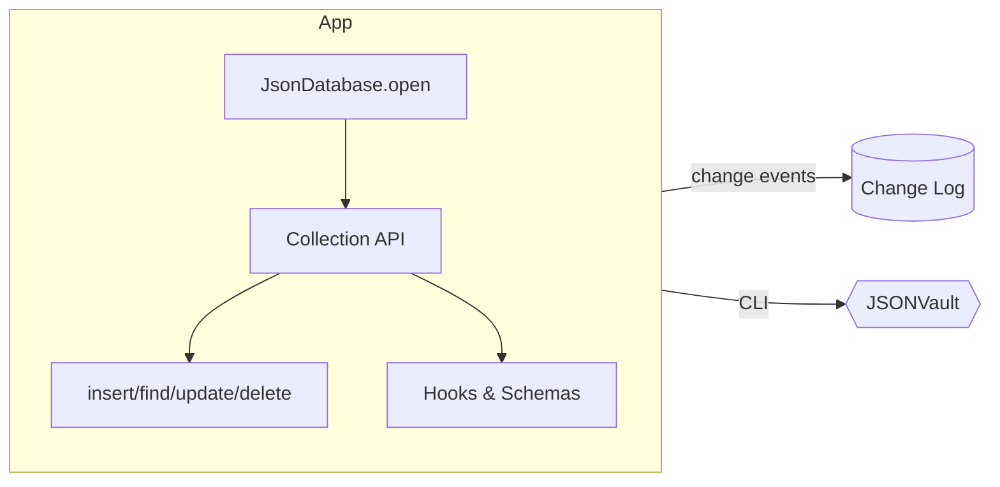

import Tabs from '@theme/Tabs';
import TabItem from '@theme/TabItem';



## 1. Open the database

Create a `JsonDatabase` instance pointing at a folder on disk:

```js title="db.js"
const { JsonDatabase } = require("jsonvault");

async function openDb() {
  return JsonDatabase.open({
    path: "./data",
    changeLog: { path: "./data/changelog.jsonl" },
    ttlIntervalMs: 30_000,
  });
}
```

## 2. Define (optional) schema and hooks

```js title="users.js"
const { createSchema } = require("jsonvault");

const userSchema = createSchema({
  fields: {
    name: { type: "string", required: true },
    email: {
      type: "string",
      required: true,
      pattern: ".+@.+\\..+",
      transform: (value) => value.toLowerCase(),
    },
    roles: { type: "array", items: "string", default: () => [] },
  },
  allowAdditional: false,
});

function attachUsers(db) {
  return db.collection("users", {
    schema: userSchema,
    hooks: {
      beforeInsert(doc) {
        doc.slug = doc.name.toLowerCase().replace(/\s+/g, "-");
      },
      afterInsert(doc) {
        console.log("new user", doc._id);
      },
    },
  });
}
```

## 3. Run queries

```js title="app.js"
const db = await openDb();
const users = attachUsers(db);

await users.insertOne({ name: "Ada Lovelace", email: "ADA@example.com" });
await users.updateOne({ email: "ada@example.com" }, { $set: { active: true } });

const admins = await users.find({ roles: { $contains: "admin" } });
const activeTotal = await users.count({ active: true });

await db.save();
await db.close();
```

## 4. Add access policies

```js title="policies.js"
const { PolicyDeniedError } = require("jsonvault");

db.policy("orders", {
  read({ row, ctx }) {
    if (!ctx) return false;
    return ctx.role === "admin" || row.userId === ctx.userId;
  },
  write({ previous, next, ctx, operation }) {
    if (!ctx) return false;
    if (ctx.role === "admin") return true;
    if (operation === "insert") return next?.userId === ctx.userId;
    if (operation === "update") {
      return previous?.userId === ctx.userId && next?.userId === ctx.userId;
    }
    if (operation === "delete") return previous?.userId === ctx.userId;
    return false;
  },
  redact({ row, ctx }) {
    return ctx?.role === "admin" ? row : { ...row, internalNotes: undefined };
  },
});

const aliceDb = db.with({ userId: "alice", role: "user" });

try {
  await aliceDb.collection("orders").insertOne({ userId: "bob", total: 10 });
} catch (error) {
  if (error instanceof PolicyDeniedError) {
    console.warn("Denied by policy");
  }
}
```

`db.with(context)` scopes the current async context so every collection call, SQL query, or compiled stream inside that scope inherits the same access rules.

## 5. Explore other entry points

<Tabs>
  <TabItem value="sql" label="SQL Helper">

```js
const highValue = await db.sql`
  SELECT orders.id AS orderId, users.email
  FROM orders
  JOIN users ON orders.userId = users._id
  WHERE orders.total > 1000
  ORDER BY orderId
`;
```

  </TabItem>
  <TabItem value="cli" label="CLI">

```bash
npx jsonvault migrate ./data up --dir=./migrations
npx jsonvault query ./data "SELECT userId, SUM(total) AS spend FROM orders GROUP BY userId"
```

  </TabItem>
  <TabItem value="watch" label="Change Log / Watcher">

```js
const tail = await db.changeLog.read({ from: 42 });
const watcher = db.watch("orders/**");
watcher.on("change", console.log);
```

  </TabItem>
</Tabs>

## What’s next?

- Dive into **[Concepts](../concepts/data-model)** to understand collections, indexes, and partitions.
- Follow the **[Migrations guide](../concepts/migrations)** to manage schema drift safely.
- Check **[Reference → Configuration](../reference/configuration)** for all available options.
